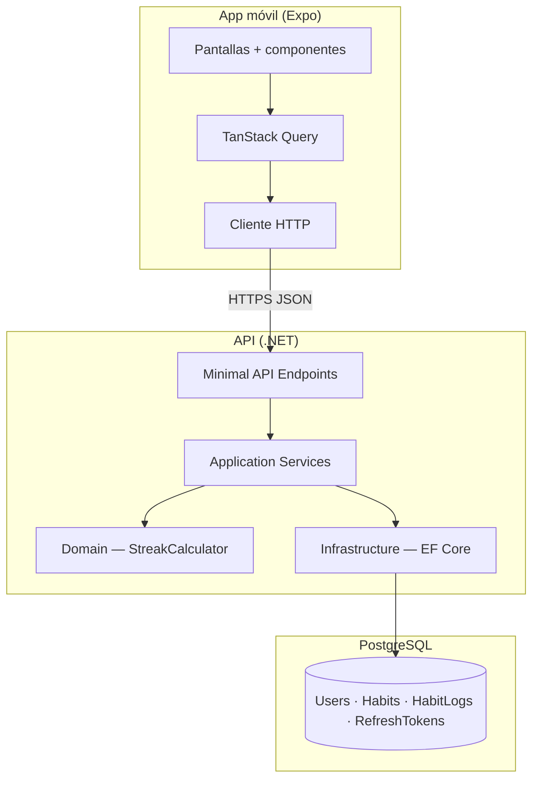
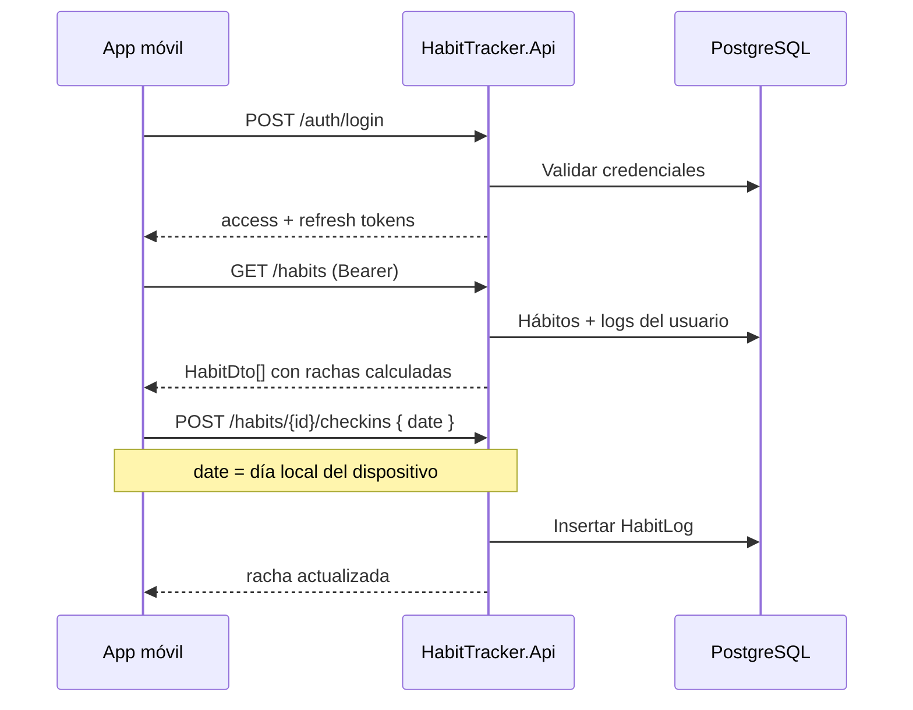
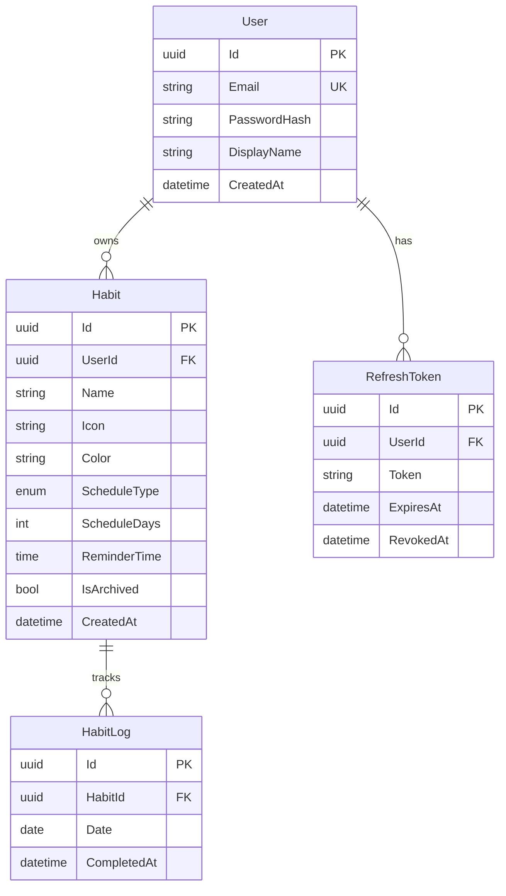

# HabitTracker


App móvil de seguimiento de hábitos con rachas, estadísticas y recordatorios locales — backend en .NET 8 y cliente en Expo/React Native.

## Capturas

| Hoy | Detalle + calendario | Estadísticas | Crear hábito |
|-----|---------------------|--------------|--------------|
|  |  |  |  |


> Genera las capturas con la cuenta demo (`demo@habittracker.local`) después de levantar el stack con `SEED_DEMO_DATA=true`.

## Stack tecnológico

| Capa | Tecnología |
|------|------------|
| API | .NET 8 Minimal APIs, EF Core 8 |
| Base de datos | PostgreSQL 16 |
| Auth | JWT + refresh tokens (rotación) |
| Mobile | Expo SDK 57, React Native, TypeScript |
| Estado remoto | TanStack Query |
| Gráficas | Victory Native + Skia |
| Contenedores | Docker Compose |

## Arquitectura





## Cómo correrlo

### Requisitos

- Docker y Docker Compose
- Node.js ≥ 20.19 (para Expo)
- Expo Go en tu dispositivo o simulador

### 1. Backend con Docker

```bash
cp .env.example .env
# Edita JWT__Key con al menos 32 caracteres aleatorios

# Opcional: datos demo para capturas y pruebas
echo "SEED_DEMO_DATA=true" >> .env

docker compose up --build
```

- API: http://localhost:5000
- Swagger (Development): http://localhost:5000/swagger
- Health: http://localhost:5000/health

### 2. App móvil

```bash
cd mobile
npm install

# Obtén tu IP local (macOS)
ipconfig getifaddr en0

# Apunta la app a tu máquina
export EXPO_PUBLIC_API_URL=http://<TU_IP>:5000/api/v1

npx expo start
```

Escanea el QR con Expo Go. **No uses `localhost`** — el teléfono necesita la IP de tu red local.

### Credenciales demo

| Campo | Valor |
|-------|-------|
| Email | `demo@habittracker.local` |
| Contraseña | `Demo1234` |

Requiere `SEED_DEMO_DATA=true` en `.env` antes de levantar Docker.

## Decisiones técnicas

### Fecha enviada por el cliente, no el servidor

Las rachas dependen del **día local** del usuario. Si el servidor usara UTC, alguien en UTC-6 vería su racha romperse a medianoche del servidor, no la suya. El cliente envía `YYYY-MM-DD` local; el servidor valida ±1 día de tolerancia.

### `StreakCalculator` es una función pura con `today` como parámetro

Permite calcular rachas de forma determinista y testeable sin depender de `DateTime.UtcNow`. Los tests fijan `today` y verifican todos los escenarios sin mocks de reloj.

### Los días no programados no rompen la racha

Un hábito de lunes/miércoles/viernes no se evalúa martes ni jueves. Solo los días **programados** cuentan; un martes sin check-in no penaliza.

### Rotación de refresh tokens

Al refrescar la sesión, el token anterior se revoca y se emite uno nuevo. Limita el daño si un refresh token se filtra.

### 404 en lugar de 403 para recursos ajenos

`GET /habits/{id}` de otro usuario responde **404**, no 403. Evita confirmar la existencia de IDs ajenos (menor fuga de información).

### Evitar N+1 al calcular rachas

Al listar hábitos, los logs se cargan en una sola consulta agrupada por `HabitId`, no una query por hábito. `StreakCalculator` corre en memoria sobre el conjunto ya cargado.

## Modelo de datos



## API

Documentación interactiva en Development: http://localhost:5000/swagger

| Método | Ruta | Descripción |
|--------|------|-------------|
| POST | `/api/v1/auth/register` | Registro |
| POST | `/api/v1/auth/login` | Login |
| POST | `/api/v1/auth/refresh` | Renovar tokens |
| POST | `/api/v1/auth/logout` | Cerrar sesión |
| GET | `/api/v1/me` | Perfil actual |
| GET | `/api/v1/habits` | Listar hábitos activos |
| POST | `/api/v1/habits` | Crear hábito |
| GET | `/api/v1/habits/{id}` | Detalle |
| PUT | `/api/v1/habits/{id}` | Actualizar |
| POST | `/api/v1/habits/{id}/archive` | Archivar |
| POST | `/api/v1/habits/{id}/unarchive` | Restaurar |
| POST | `/api/v1/habits/{id}/checkins` | Check-in |
| DELETE | `/api/v1/habits/{id}/checkins/{date}` | Deshacer check-in |
| GET | `/api/v1/habits/{id}/logs?month=YYYY-MM` | Calendario mensual |
| GET | `/api/v1/habits/{id}/stats` | Estadísticas del hábito |
| GET | `/api/v1/stats/summary` | Resumen global |
| GET | `/health` | Health check |

## Tests

```bash
# Backend
dotnet test

# Mobile (tipos)
cd mobile && npm run typecheck
```

**Cobertura principal:**
- `StreakCalculator` — rachas diarias, días específicos, días de gracia, rendimiento
- `HabitService` — CRUD, check-ins, autorización, integración con rachas
- `AuthService` — registro, login, refresh, errores
- `HabitStatsCalculator` — logs, tasas de cumplimiento, resumen

## Roadmap / fuera de alcance

Estas omisiones son **decisiones conscientes**, no pendientes olvidados:

- Publicación en App Store / Play Store
- CI/CD y despliegue en cloud
- Push notifications remotas (solo locales en el móvil)
- Sincronización multi-dispositivo en tiempo real
- Modo offline con cola de sincronización completa

## Proceso spec-driven

Los planes de diseño e implementación están en [`docs/plans/`](docs/plans/) — muestran cómo se construyó el proyecto por fases incrementales.
